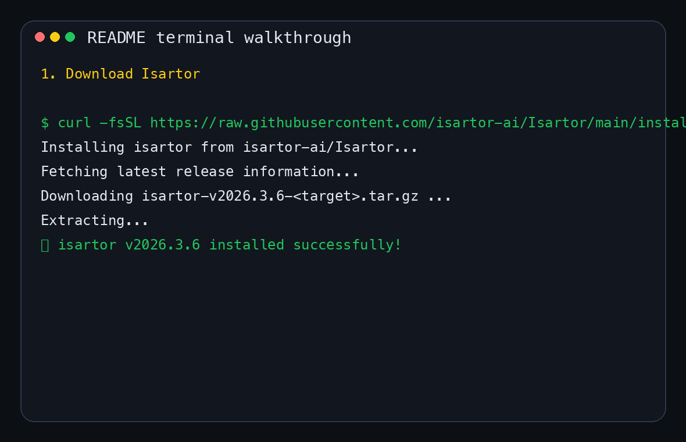

<p align="center">
  
</p>

<h1 align="center">Isartor</h1>

<p align="center">
  <strong>Open-source Prompt Firewall — deflect up to 95% of redundant LLM traffic before it leaves your infrastructure.</strong>
</p>

<p align="center">
  Pure Rust · Single Binary · Zero Hidden Telemetry · Air-Gappable
</p>

<p align="center">
  <a href="https://github.com/isartor-ai/Isartor/actions"></a>
  <a href="https://codecov.io/gh/isartor-ai/Isartor"></a>
  <a href="LICENSE"></a>
  <a href="https://github.com/isartor-ai/Isartor/releases/latest"></a>
  <a href="https://github.com/isartor-ai/Isartor/releases"></a>
  <a href="https://discord.com/channels/1487002530113257492/1487002530700464142"></a>
  <a href="https://github.com/orgs/isartor-ai/packages/container/package/isartor"></a>
  <a href="https://isartor-ai.github.io/Isartor/"></a>
</p>

---

## Quick Start

```bash
# Install (macOS / Linux)
curl -fsSL https://raw.githubusercontent.com/isartor-ai/Isartor/main/install.sh | sh

# Guided setup (provider, optional L2, connectors, verification)
isartor setup

# Or configure manually (example: Groq)
# isartor set-key -p groq
# isartor set-alias --alias fast --model gpt-4o-mini

# Verify the provider and run the post-install showcase
isartor check
isartor providers
isartor demo

# Connect your AI tool (pick one)
# (or start the gateway directly if you're ready)
isartor up
isartor connect copilot          # GitHub Copilot CLI
isartor connect claude           # Claude Code
isartor connect claude-desktop   # Claude Desktop
isartor connect cursor           # Cursor IDE
isartor connect openclaw         # OpenClaw
isartor connect codex            # OpenAI Codex CLI
isartor connect gemini           # Gemini CLI
isartor connect claude-copilot   # Claude Code + GitHub Copilot
```

The best first-run path is now: **install → `isartor setup` → demo → connect tool**. If you prefer the old explicit flow, `set-key`, `check`, and `connect` still work exactly as before. `isartor demo` still works without an API key, but with a configured provider it now also shows a live upstream round-trip before the cache replay.

You can also define request-time model aliases like `fast`, `smart`, or `code` that resolve to real provider model IDs before routing and cache-key generation.

For provider troubleshooting, Isartor also supports opt-in request/response debug logging. Set `ISARTOR__ENABLE_REQUEST_LOGS=true`, reproduce the issue, and inspect the separate JSONL stream with `isartor logs --requests`. Auth headers are redacted automatically, but prompt bodies may still contain sensitive data, so leave it off unless you need it.

For a fast Layer 3 status snapshot, run `isartor providers` or query the authenticated `GET /debug/providers` endpoint. It reports the active provider, configured model and endpoint, plus the last-known in-memory success/error state for upstream traffic since the current process started.

The provider registry also includes a broader set of OpenAI-compatible backends out of the box, including `cerebras`, `nebius`, `siliconflow`, `fireworks`, `nvidia`, and `chutes`, so `isartor set-key -p <provider>` and `isartor setup` can configure them without manual endpoint lookup.

## See Isartor in the Terminal

<p align="center">
  
</p>

<p align="center">
  <sub>Terminal walkthrough: install Isartor, start the gateway, then run the demo showcase.</sub>
</p>

<details>
<summary><strong>More install options</strong> (Docker · Windows · Build from source)</summary>

#### Docker

```bash
docker run -p 8080:8080 \
  -e HF_HOME=/tmp/huggingface \
  -v isartor-hf:/tmp/huggingface \
  ghcr.io/isartor-ai/isartor:latest
```

> ~120 MB compressed. Includes the `all-MiniLM-L6-v2` embedding model and a statically linked Rust binary.

#### Windows (PowerShell)

```powershell
irm https://raw.githubusercontent.com/isartor-ai/Isartor/main/install.ps1 | iex
```

#### Build from source

```bash
git clone https://github.com/isartor-ai/Isartor.git
cd Isartor && cargo build --release
./target/release/isartor up
```

</details>

---

## How It Works


If you already know your provider credentials, the day-one path is:

```bash
curl -fsSL https://raw.githubusercontent.com/isartor-ai/Isartor/main/install.sh | sh
isartor setup
isartor demo
isartor up --detach
isartor connect copilot
```

---

## Why Isartor?

AI coding agents and personal assistants repeat themselves — a lot. Copilot, Claude Code, Cursor, and OpenClaw send the same system instructions, the same context preambles, and often the same user prompts across every turn of a conversation. Standard API gateways forward all of it to cloud LLMs regardless.

**Isartor sits between your tools and the cloud.** It intercepts every prompt and runs a cascade of local algorithms — from sub-millisecond hashing to in-process neural inference — to resolve requests before they reach the network. Only the genuinely hard prompts make it through.

The result: **lower costs, lower latency, and less data leaving your perimeter.**

| | Without Isartor | With Isartor |
|:--|:----------------|:-------------|
| Repeated prompts | Full cloud round-trip every time | Answered locally in < 1 ms |
| Similar prompts ("Price?" / "Cost?") | Full cloud round-trip every time | Matched semantically, answered locally in 1–5 ms |
| System instructions (CLAUDE.md, copilot-instructions) | Sent in full on every request | Deduplicated and compressed per session |
| Simple FAQ / data extraction | Routed to GPT-4 / Claude | Resolved by embedded SLM in 50–200 ms |
| Complex reasoning | Routed to cloud | Routed to cloud ✓ |

---

## The Deflection Stack

Every request passes through five layers. Only prompts that survive the full stack reach the cloud.

```
Request ──► L1a Exact Cache ──► L1b Semantic Cache ──► L2 SLM Router ──► L2.5 Context Optimiser ──► L3 Cloud
                 │ hit                │ hit                 │ simple             │ compressed               │
                 ▼                    ▼                     ▼                    ▼                          ▼
              Instant             Instant             Local Answer      Smaller Prompt             Cloud Answer
```

| Layer | What It Does | How | Latency |
|:------|:-------------|:----|:--------|
| **L1a** Exact Cache | Traps duplicate prompts and agent loops | `ahash` deterministic hashing | < 1 ms |
| **L1b** Semantic Cache | Catches paraphrases ("Price?" ≈ "Cost?") | Cosine similarity via pure-Rust `candle` embeddings | 1–5 ms |
| **L2** SLM Router | Resolves simple queries locally | Embedded Small Language Model (Qwen-1.5B via `candle` GGUF) | 50–200 ms |
| **L2.5** Context Optimiser | Compresses repeated instructions per session | Dedup + minify (CLAUDE.md, copilot-instructions) | < 1 ms |
| **L3** Cloud Logic | Routes complex prompts to OpenAI / Anthropic / Azure | Load balancing with retry and fallback | Network-bound |

### Benchmark results

| Workload | Deflection Rate | Detail |
|:---------|:---------------:|:-------|
| Warm agent session (Claude Code, 20 prompts) | **95%** | L1a 80% · L1b 10% · L2 5% · L3 5% |
| Repetitive FAQ loop (1,000 prompts) | **60%** | L1a 41% · L1b 19% · L3 40% |
| Diverse code-generation tasks (78 prompts) | **38%** | Exact-match duplicates only; all unique tasks route to L3 |

P50 latency for a cache hit: **0.3 ms.** [Full benchmark methodology →](benchmarks/README.md)

---

## AI Tool Integrations

One command connects your favourite tool. No proxy, no MITM, no CA certificates.

| Tool | Command | Mechanism |
|:-----|:--------|:----------|
| **GitHub Copilot CLI** | `isartor connect copilot` | MCP server (stdio or HTTP/SSE at `/mcp/`) |
| **GitHub Copilot in VS Code** | `isartor connect copilot-vscode` | Managed `settings.json` debug overrides |
| **OpenClaw** | `isartor connect openclaw` | Managed OpenClaw provider config (`openclaw.json`) |
| **Claude Code** | `isartor connect claude` | `ANTHROPIC_BASE_URL` override |
| **Claude Desktop** | `isartor connect claude-desktop` | Managed local MCP registration (`isartor mcp`) |
| **Claude Code + Copilot** | `isartor connect claude-copilot` | Claude base URL + Copilot-backed L3 |
| **Cursor IDE** | `isartor connect cursor` | Base URL + MCP registration at `/mcp/` |
| **OpenAI Codex CLI** | `isartor connect codex` | `OPENAI_BASE_URL` override |
| **Gemini CLI** | `isartor connect gemini` | `GEMINI_API_BASE_URL` override |
| **OpenCode** | `isartor connect opencode` | Global provider + auth config |
| **Any OpenAI-compatible tool** | `isartor connect generic` | Configurable env var override |

[Full integration guides →](https://isartor-ai.github.io/Isartor/integrations/overview.html)

OpenClaw note: use Isartor's OpenAI-compatible `/v1` base path, not the root `:8080` URL. If you change Isartor's gateway API key later, rerun `isartor connect openclaw` so OpenClaw's per-agent model registry refreshes too.

---

## How Isartor Compares

This is the honest version: Isartor is not trying to be every kind of AI platform. It is optimized for **local-first prompt deflection in front of coding tools and OpenAI-compatible clients**.

| Product | Public positioning | Best fit | Where Isartor differs |
|:--------|:-------------------|:---------|:----------------------|
| **Isartor** | Open-source prompt firewall and local deflection gateway | Teams that want redundant prompt traffic resolved locally before it hits the cloud | Single Rust binary, client connectors, exact+semantic cache, context compression, coding-agent-first workflow |
| **LiteLLM** | Open-source multi-provider LLM gateway with routing, fallbacks, and spend tracking | Teams that want one OpenAI-style API across many providers and models | LiteLLM is gateway/routing-first; Isartor is deflection-first and focuses on reducing traffic before cloud routing |
| **Portkey** | AI gateway, observability, guardrails, governance, and prompt management platform | Teams that want a broader managed production control plane for GenAI apps | Portkey emphasizes platform governance and observability; Isartor emphasizes local cache/SLM deflection in a self-hosted binary |
| **Bifrost** | Enterprise AI gateway with governance, guardrails, and MCP gateway positioning | Teams that want enterprise control, security, and production gateway features | Bifrost is enterprise-gateway oriented; Isartor is optimized for prompt firewall behavior and lightweight local deployment |
| **Helicone** | Routing, debugging, and observability for AI apps | Teams that primarily want analytics, traces, and request inspection | Helicone is observability-first; Isartor is designed to stop repeat traffic from leaving your perimeter in the first place |

The short version:

- choose **Isartor** when your problem is repeated coding-agent traffic, prompt firewalling, and local-first savings
- choose **LiteLLM** when your main problem is multi-provider routing and unified model access
- choose **Portkey / Bifrost / Helicone** when your center of gravity is broader gateway control, observability, or enterprise governance

---

## Drop-In for Any OpenAI SDK

Isartor is fully OpenAI-compatible and Anthropic-compatible. Point any existing SDK at it by changing one URL:

```python
import openai

client = openai.OpenAI(
    base_url="http://localhost:8080/v1",
    api_key="your-isartor-api-key",
)

# First call → routed to cloud (L3), cached on return
response = client.chat.completions.create(
    model="gpt-4",
    messages=[{"role": "user", "content": "Explain the builder pattern in Rust"}],
)

# Second identical call → answered from L1a cache in < 1 ms
response = client.chat.completions.create(
    model="gpt-4",
    messages=[{"role": "user", "content": "Explain the builder pattern in Rust"}],
)
```

Works with the official Python/Node SDKs, LangChain, LlamaIndex, AutoGen, CrewAI, OpenClaw, or any OpenAI-compatible client.

If you prefer friendly names over provider model IDs, add aliases in `isartor.toml`:

```toml
[model_aliases]
fast = "gpt-4o-mini"
smart = "gpt-4o"
```

Then clients can send `model="fast"` and Isartor will route it as `gpt-4o-mini`.

---

## Scales from Laptop to Cluster

The same binary adapts from a developer laptop to a multi-replica Kubernetes deployment. Switch modes entirely through environment variables — no code changes, no recompilation.

| Component | Laptop (Single Binary) | Enterprise (K8s) |
|:----------|:-----------------------|:------------------|
| **L1a Cache** | In-memory LRU | Redis cluster (shared across replicas) |
| **L1b Embeddings** | In-process `candle` BertModel | External TEI sidecar |
| **L2 SLM** | Embedded `candle` GGUF inference | Remote vLLM / TGI (GPU pool) |
| **L2.5 Optimiser** | In-process | In-process |
| **L3 Cloud** | Direct to provider | Direct to provider |

```bash
# Flip to enterprise mode — just env vars, same binary
export ISARTOR__CACHE_BACKEND=redis
export ISARTOR__REDIS_URL=redis://redis-cluster.svc:6379
export ISARTOR__ROUTER_BACKEND=vllm
export ISARTOR__VLLM_URL=http://vllm.svc:8000
```

---

## Observability

Built-in **OpenTelemetry** traces and **Prometheus** metrics — no extra instrumentation.

- **Distributed traces** — root span `gateway_request` with child spans per layer (`l1a_exact_cache`, `l1b_semantic_cache`, `l2_classify_intent`, `context_optimise`, `l3_cloud_llm`).
- **Prometheus metrics** — `isartor_request_duration_seconds`, `isartor_layer_duration_seconds`, `isartor_requests_total`.
- **ROI tracking** — `isartor_tokens_saved_total` counts tokens that never left your infrastructure. Pipe it into Grafana to prove savings.

```bash
export ISARTOR__ENABLE_MONITORING=true
export ISARTOR__OTEL_EXPORTER_ENDPOINT=http://otel-collector:4317
```

[Observability guide →](https://isartor-ai.github.io/Isartor/observability/metrics-tracing.html)

---

## Trusted By

Today, Isartor is dogfooded by the **Isartor AI engineering team** for:

- connector development across Copilot, Claude, Cursor, and OpenClaw flows
- benchmark and release validation runs
- local-first prompt deflection testing during coding-agent workflows

We are keeping this section intentionally conservative until external teams explicitly opt in to being listed.

---

## CLI Reference

```
isartor up                     Start the API gateway
isartor up --detach            Start in background
isartor logs --follow          Follow detached Isartor logs
isartor up copilot             Start gateway + Copilot CONNECT proxy
isartor stop                   Stop a running instance
isartor demo                   Run the post-install showcase (cache-only or live + cache)
isartor init                   Generate a commented config scaffold
isartor set-key -p openai      Configure your LLM provider API key
isartor providers             Show active provider config + in-memory health
isartor stats                  Prompt totals, layer hits, routing history
isartor stats --by-tool        Per-tool cache hits, latency, errors
isartor update                 Self-update to the latest release
isartor connect <tool>         Connect an AI tool (see integrations above)
```

---

## Documentation

📚 **[isartor-ai.github.io/Isartor](https://isartor-ai.github.io/Isartor/)**

| | |
|:--|:--|
| [Getting Started](https://isartor-ai.github.io/Isartor/getting-started/installation.html) | Installation, first request, config basics |
| [Architecture](https://isartor-ai.github.io/Isartor/concepts/architecture.html) | Deflection Stack deep dive, trait provider pattern |
| [Integrations](https://isartor-ai.github.io/Isartor/integrations/overview.html) | Copilot, Cursor, Claude, Codex, Gemini, generic |
| [Deployment](https://isartor-ai.github.io/Isartor/deployment/level1-minimal.html) | Minimal → Sidecar → Enterprise (K8s) → Air-Gapped |
| [Configuration](https://isartor-ai.github.io/Isartor/configuration/reference.html) | Every environment variable and config key |
| [Observability](https://isartor-ai.github.io/Isartor/observability/metrics-tracing.html) | Spans, metrics, Grafana dashboards |
| [Performance Tuning](https://isartor-ai.github.io/Isartor/observability/performance-tuning.html) | Deflection measurement, SLO/SLA templates |
| [Troubleshooting](https://isartor-ai.github.io/Isartor/development/troubleshooting.html) | Common issues, diagnostics, FAQ |
| [Contributing](https://isartor-ai.github.io/Isartor/development/contributing.html) | Dev setup, PR guidelines |
| [Governance](GOVERNANCE.md) | Independence, license stability, decision-making |

---

## Contributing

Contributions welcome! See [CONTRIBUTING.md](CONTRIBUTING.md) for dev setup and PR guidelines.

```bash
cargo build && cargo test --all-features
cargo clippy --all-targets --all-features -- -D warnings
```

---

## License

Apache License, Version 2.0 — see [LICENSE](LICENSE).

Isartor is and will remain open source. No bait-and-switch relicensing. See [GOVERNANCE.md](GOVERNANCE.md) for the full commitment.

---

<p align="center">
  <sub>If Isartor saves you tokens, consider giving it a ⭐</sub>
</p>
