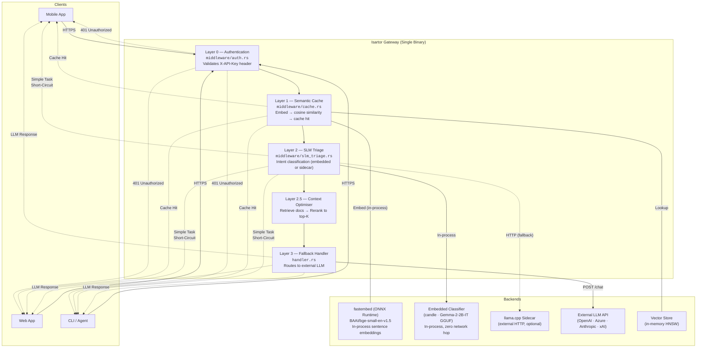
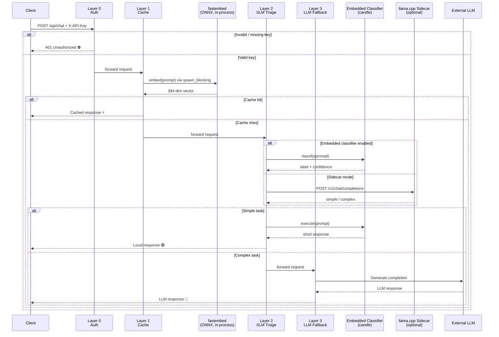
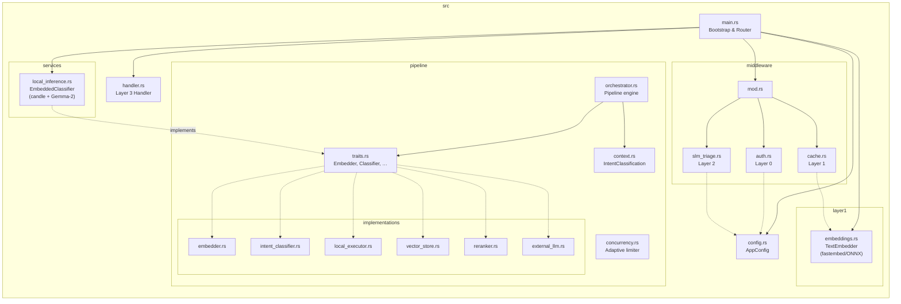
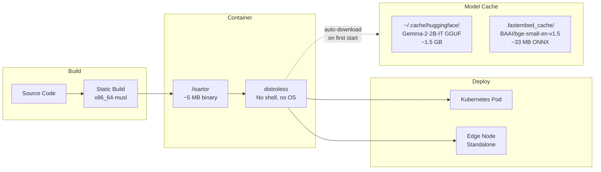

# Layer 1a: Exact-match Cache (Updated)

Layer 1a now uses a high-performance, concurrent, bounded LRU cache (`ExactMatchCache`) implemented with `ahash`, `lru`, and `parking_lot`. This replaces the legacy async `ExactCache` (HashMap-based).

**Current Implementation:**

```text
ExactMatchCache (sync, LRU, ahash, parking_lot)
```

All Layer 1a cache operations are synchronous and thread-safe. The cache is part of `AppState` and is accessed directly in the Layer 1a middleware. All legacy `ExactCache` code and references have been removed.

## Migration Notes

- Removed: `ExactCache` (async, HashMap-based)
- Added: `ExactMatchCache` (sync, LRU, ahash, parking_lot)
- Updated: `AppState`, `middleware/cache.rs`, and all usages to use the new cache API.

## Pluggable Trait Provider Pattern

Isartor uses a Hexagonal Architecture (Ports & Adapters) for cache and
router backends. Trait interfaces ("Ports") in `src/core/ports.rs` decouple
the pipeline from any concrete implementation. A factory in `src/factory.rs`
reads `AppConfig` and wires the correct adapter at startup.

| Port | Minimalist Adapter | Enterprise Adapter |
|------|--------------------|--------------------|
| `ExactCache` | `InMemoryCache` (ahash + LRU) | `RedisExactCache` (Redis) |
| `SlmRouter` | `EmbeddedCandleRouter` (Candle) | `RemoteVllmRouter` (vLLM) |

Full details: [`docs/ARCHITECTURE.md`](docs/ARCHITECTURE.md)
# Isartor — Intelligent AI Orchestration Gateway Architecture

## High-Level Overview



## Request Pipeline (The Funnel)

Each layer can **short-circuit** the pipeline by returning a response directly, avoiding unnecessary downstream work.



## Module Map



## Embedded Classifier — In-Process ML Inference

The **Embedded Classifier** (`src/services/local_inference.rs`) is a Rust-native ML inference engine that replaces the external llama.cpp sidecar for Layer 2 (intent classification) and simple-task execution. It loads a quantised Gemma-2-2B-IT model directly into the process using the [candle](https://github.com/huggingface/candle) framework.

### Why Embedded?

| Aspect | llama.cpp Sidecar | Embedded Classifier |
|---|---|---|
| **Deployment** | Extra container + HTTP port | Zero additional processes |
| **Latency** | Network round-trip (~1–5 ms overhead) | Direct function call (~0 ms overhead) |
| **Failure modes** | Sidecar crash, connection refused, timeouts | Only OOM or model corruption |
| **Observability** | External process logs | Rust-native `tracing` spans with token-level metrics |
| **Memory** | Separate process memory | Shared process heap (~1.5 GB for Q4_K_M) |

### Architecture

```
EmbeddedClassifier
├── tokenizer: Arc<Tokenizer>          ← HuggingFace tokenizers (tokenizer.json)
├── model: Arc<Mutex<ModelWeights>>    ← candle quantised GGUF weights
├── device: Device::Cpu                ← CPU inference (VPS-compatible)
├── config: EmbeddedClassifierConfig   ← repo_id, gguf_filename, max_tokens, …
└── eot_token_id: u32                  ← Gemma-2 <end_of_turn> token
```

### Inference Flow

```
User Prompt
    │
    ▼
┌──────────────────────────────────┐
│ Format with Gemma-2 chat template│
│ <start_of_turn>user\n            │
│ {system_prompt}\n{user_query}    │
│ <end_of_turn>\n                  │
│ <start_of_turn>model\n           │
└───────────────┬──────────────────┘
                │
                ▼
┌──────────────────────────────────┐
│ Tokenise (HF Tokenizers)         │
└───────────────┬──────────────────┘
                │
                ▼
┌──────────────────────────────────┐
│ Prefill: forward(prompt_tokens)  │  ← Single batched forward pass
│ Decode loop:                     │  ← One token at a time
│   forward([token], index_pos)    │
│   sample_token(logits)           │  ← Greedy argmax + rep. penalty
│   break on <end_of_turn> or max  │
└───────────────┬──────────────────┘
                │
                ▼
┌──────────────────────────────────┐
│ Detokenise → raw text            │
│ Parse LABEL: / CONFIDENCE:       │  ← (classification only)
└──────────────────────────────────┘
```

### Thread Safety

`ModelWeights::forward()` requires `&mut self` to update internal KV-cache masks. Since pipeline traits use `&self`, the model is wrapped in `tokio::sync::Mutex`. All CPU-bound inference is dispatched to `tokio::task::spawn_blocking` to avoid starving the async runtime.

### Classification Prompt & Response Format

**Prompt** (injected as system instruction):
```
You are a request classifier for an AI gateway. Analyse the user's prompt
and classify it into EXACTLY ONE of these categories:
- SIMPLE — Greetings, basic factual questions, short answers, simple math.
- COMPLEX — Deep reasoning, multi-step analysis, creative writing.
- RAG — Questions needing external documents or citations.
- CODEGEN — Code generation, debugging, programming tasks.

Reply with EXACTLY this format:
LABEL: <one of SIMPLE|COMPLEX|RAG|CODEGEN>
CONFIDENCE: <a number between 0.0 and 1.0>
```

**Expected response**:
```
LABEL: SIMPLE
CONFIDENCE: 0.95
```

The parser falls back to keyword detection and defaults to `COMPLEX` (safest routing) if the model produces unexpected output.

### Model Details

| Property | Value |
|---|---|
| **Base model** | Google Gemma-2-2B-IT |
| **Quantisation** | Q4_K_M (~1.5 GB) via GGUF |
| **HF repository** | `mradermacher/gemma-2-2b-it-GGUF` |
| **Tokenizer source** | `google/gemma-2-2b-it` (canonical) |
| **Candle backend** | `candle_transformers::models::quantized_llama::ModelWeights` |
| **Download** | Automatic via `hf-hub` (cached in `~/.cache/huggingface/`) |

## Configuration

| Env Variable | Field | Default | Used By |
|---|---|---|---|
| `ISARTOR__HOST_PORT` | `host_port` | `0.0.0.0:8080` | `main.rs` |
| `ISARTOR__GATEWAY_API_KEY` | `gateway_api_key` | `changeme` | Layer 0 |
| `ISARTOR__INFERENCE_ENGINE` | `inference_engine` | `sidecar` | Layer 2 engine mode |
| `ISARTOR__CACHE_BACKEND` | `cache_backend` | `memory` | `memory` (in-process LRU) or `redis` (distributed) |
| `ISARTOR__REDIS_URL` | `redis_url` | `redis://127.0.0.1:6379` | Redis connection (when `cache_backend=redis`) |
| `ISARTOR__ROUTER_BACKEND` | `router_backend` | `embedded` | `embedded` (Candle GGUF) or `vllm` (remote) |
| `ISARTOR__VLLM_URL` | `vllm_url` | `http://127.0.0.1:8000` | vLLM server URL (when `router_backend=vllm`) |
| `ISARTOR__VLLM_MODEL` | `vllm_model` | `gemma-2-2b-it` | vLLM model name (when `router_backend=vllm`) |
| `ISARTOR__LAYER2__SIDECAR_URL` | `layer2.sidecar_url` | `http://127.0.0.1:8081` | Layer 2 (sidecar mode) |
| `ISARTOR__LAYER2__MODEL_NAME` | `layer2.model_name` | `phi-3-mini` | Layer 2 (sidecar mode) |
| `ISARTOR__EMBEDDING_SIDECAR__SIDECAR_URL` | `embedding_sidecar.sidecar_url` | `http://127.0.0.1:8082` | v2 Pipeline (legacy; v1 uses in-process fastembed) |
| `ISARTOR__EXTERNAL_LLM_API_KEY` | `external_llm_api_key` | *(empty)* | Layer 3 |

### Embedded Classifier Configuration

| Env Variable | Field | Default | Description |
|---|---|---|---|
| `ISARTOR__EMBEDDED_CLASSIFIER__REPO_ID` | `embedded_classifier.repo_id` | `mradermacher/gemma-2-2b-it-GGUF` | HF repository hosting the GGUF model |
| `ISARTOR__EMBEDDED_CLASSIFIER__GGUF_FILENAME` | `embedded_classifier.gguf_filename` | `gemma-2-2b-it.Q4_K_M.gguf` | GGUF model filename |
| `ISARTOR__EMBEDDED_CLASSIFIER__MAX_CLASSIFY_TOKENS` | `embedded_classifier.max_classify_tokens` | `20` | Max tokens for classification |
| `ISARTOR__EMBEDDED_CLASSIFIER__MAX_GENERATE_TOKENS` | `embedded_classifier.max_generate_tokens` | `256` | Max tokens for simple-task execution |
| `ISARTOR__EMBEDDED_CLASSIFIER__TEMPERATURE` | `embedded_classifier.temperature` | `0.0` | Sampling temperature (0 = greedy) |
| `ISARTOR__EMBEDDED_CLASSIFIER__REPETITION_PENALTY` | `embedded_classifier.repetition_penalty` | `1.1` | Repetition penalty |

## Deployment



### Memory Budget (Embedded Mode)

| Component | Approximate Size |
|---|---|
| Isartor binary | ~5 MB |
| fastembed ONNX model (BAAI/bge-small-en-v1.5) | ~33 MB |
| Gemma-2-2B-IT Q4_K_M | ~1.5 GB |
| Tokenizer | ~3 MB |
| Runtime overhead | ~50 MB |
| **Total** | **~1.6 GB** |

For VPS/edge deployments, a 2 GB RAM instance is sufficient. The GGUF model is memory-mapped where possible, so actual RSS may be lower than the file size. The fastembed ONNX model is downloaded once on first startup and cached in `.fastembed_cache/`.
