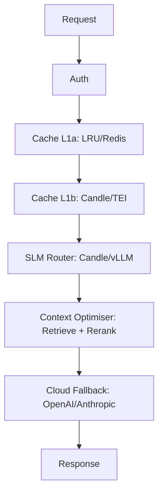

# Architecture

> **Pattern:** Hexagonal Architecture (Ports & Adapters)
> **Location:** `src/core/`, `src/adapters/`, `src/factory.rs`

## High-Level Overview

Isartor is an AI Prompt Firewall that intercepts LLM traffic and routes it through a multi-layer **Deflection Stack**. Each layer can short-circuit and return a response without reaching the cloud, dramatically reducing cost and latency.


For a detailed breakdown of the deflection layers, see the [Deflection Stack](deflection-stack.md) page.



## Pluggable Trait Provider Pattern

All layers are implemented as Rust traits and adapters. Backends are selected at startup via `ISARTOR__` environment variables — no code changes or recompilation required.

Rather than feature-flag every call-site, we define **Ports** (trait interfaces in `src/core/ports.rs`) and swap the concrete **Adapter** at startup. This keeps the Deflection Stack logic completely agnostic to the backing implementation.

| Component | Minimalist (Single Binary) | Enterprise (K8s) |
|:----------|:---------------------------|:------------------|
| **L1a Exact Cache** | In-memory LRU (`ahash` + `parking_lot`) | Redis cluster (shared across replicas) |
| **L1b Semantic Cache** | In-process `candle` BertModel | External TEI sidecar (optional) |
| **L2 SLM Router** | Embedded `candle` GGUF inference | Remote vLLM / TGI server (GPU pool) |
| **L2.5 Context Optimiser** | In-process retrieve + rerank (top-K selection) | Distributed rerank (optional TEI / ANN pool) |
| **L3 Cloud Logic** | Direct to OpenAI / Anthropic | Direct to OpenAI / Anthropic |

### Adding a New Adapter

1. **Define the struct** in `src/adapters/cache.rs` or `src/adapters/router.rs`.
2. **Implement the port trait** (`ExactCache` or `SlmRouter`).
3. **Add a variant** to the config enum (`CacheBackend` or `RouterBackend`) in `src/config.rs`.
4. **Wire it** in `src/factory.rs` with a new `match` arm.
5. **Write tests** — each adapter module has a `#[cfg(test)] mod tests`.

No other files need to change. The middleware and pipeline code operate only on `Arc<dyn ExactCache>` / `Arc<dyn SlmRouter>`.

## Scalability Model (3-Tier)

Isartor targets a wide range of deployments, from a developer's laptop to enterprise Kubernetes clusters. The same binary serves all three tiers; the runtime behaviour is entirely configuration-driven.

```text
Level 1 (Edge)           Level 2 (Compose)        Level 3 (K8s)
┌────────────────┐       ┌────────────────┐       ┌────────────────┐
│ Single Process  │       │ Firewall + GPU  │       │ N Firewall Pods │
│ memory cache    │──▶    │ Sidecar         │──▶    │ + Redis Cluster │
│ embedded candle │       │ memory cache    │       │ + vLLM Pool     │
│ context opt.    │       │ (optional)      │       │ (optional)      │
└────────────────┘       └────────────────┘       └────────────────┘
```

**Key insight:** Switching to `cache_backend=redis` unlocks true multi-replica scaling. Without it, each firewall pod maintains an independent cache.

See the deployment guides for tier-specific setup:

- [Level 1 — Minimal](../deployment/level1-minimal.md)
- [Level 2 — Sidecar](../deployment/level2-sidecar.md)
- [Level 3 — Enterprise](../deployment/level3-enterprise.md)

## Directory Layout

```text
src/
├── core/
│   ├── mod.rs            # Re-exports
│   └── ports.rs          # Trait interfaces (ExactCache, SlmRouter)
├── adapters/
│   ├── mod.rs            # Re-exports
│   ├── cache.rs          # InMemoryCache, RedisExactCache
│   └── router.rs         # EmbeddedCandleRouter, RemoteVllmRouter
├── factory.rs            # build_exact_cache(), build_slm_router()
└── config.rs             # CacheBackend, RouterBackend enums + AppConfig
```

## See Also

- [Deflection Stack](deflection-stack.md) — detailed layer-by-layer breakdown
- [Architecture Decision Records](architecture-decisions.md) — rationale behind key design choices
- [Configuration Reference](../configuration/reference.md)
