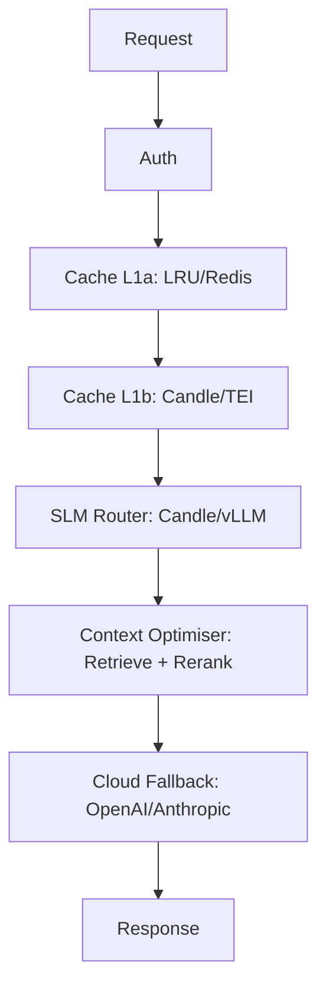

# Isartor Architecture: Layers & Modes

## Semantic Cache: Pure-Rust Vector Search

Isartor's semantic cache uses in-memory brute-force cosine similarity search over embeddings. This provides:

- Sub-millisecond vector search latency (in-memory)
- Scalable cache for thousands of embeddings
- Automatic eviction and TTL handling
- Pure Rust implementation — zero C/C++ dependencies

The vector cache is maintained in tandem with the cache entries. Insertions and evictions update the index automatically. No extra configuration is needed for default operation.

## Pure-Rust Inference Stack

Isartor uses [candle](https://github.com/huggingface/candle) for all in-process ML inference. No ONNX Runtime, no C++ toolchain, no platform-specific shared libraries — just `cargo build`.

- **Layer 1b Embeddings:** `sentence-transformers/all-MiniLM-L6-v2` via `candle_transformers::models::bert::BertModel` (384-dimensional, ~90 MB). Model weights are auto-downloaded from Hugging Face Hub on first startup.
- **Layer 2 Classification:** Gemma-2-2B-IT GGUF via candle (in-process, no sidecar).

### Running Embedding Tests

```sh
cargo test test_candle_embedder_prompt_ab_c
```
# Isartor Architecture: Layers & Modes

## Layered Funnel Overview

Isartor implements a multi-layer funnel for prompt routing and caching, using a Pluggable Trait Provider pattern. Each layer can be swapped between Minimalist (embedded) and Enterprise (external/K8s) modes via environment variables.

### Layer Definitions

| Layer           | Minimalist Single-Binary           | Enterprise K8s                |
|:---------------:|:----------------------------------:|:-----------------------------:|
| **L1a Cache**   | In-memory LRU (ahash + parking_lot)| Redis cluster (shared cache, async, via redis crate)  |
| **L1b Semantic**| Candle BertModel (in-process)      | External TEI (optional)       |
| **L2 Router**   | Embedded Candle/Qwen2 (in-process) | Remote vLLM/TGI server        |
| **L2.5 Context Optimiser** | In-process rerank (retrieve + rerank, e.g., top-K selection) | Distributed rerank (optional, e.g., TEI/ANN pool) |
| **L3 Fallback** | Cloud LLM (OpenAI/Anthropic)       | Cloud LLM (OpenAI/Anthropic)  |

- **L1a Exact Match Cache:** Fast LRU cache for prompt deduplication (single-binary) or distributed Redis cache (enterprise/K8s). Uses async Rust `redis` crate for high-throughput shared caching.
- **L1b Semantic Cache:** Vector search for semantically similar prompts.
- **L2 SLM Router:** Local or remote SLM inference (Candle, vLLM, TGI).
- **L3 Cloud Fallback:** External LLMs (OpenAI, Anthropic) for last-resort answers.

## Pluggable Trait Provider Pattern

- All layers are implemented as Rust traits and adapters.
- Backends are selected at startup via `ISARTOR__` environment variables.
- No code changes or recompilation required to switch modes.

## Mermaid.js Diagram



## Layer 2.5 — Context Optimiser

Layer 2.5 is responsible for retrieving and reranking candidate documents or responses to minimize downstream token usage. This layer typically implements top-K selection, reranking, or context window optimization before forwarding to the LLM. It is configurable via `ISARTOR__PIPELINE_RERANK_TOP_K` and is instrumented as the `context_optimise` span in observability.

## Mode Switching Example

```bash

# Switch cache to Redis (distributed, async)
export ISARTOR__CACHE_BACKEND=redis
export ISARTOR__REDIS_URL=redis://redis-cluster.svc:6379

# Switch router to remote vLLM
export ISARTOR__ROUTER_BACKEND=vllm
export ISARTOR__VLLM_URL=http://vllm.svc:8000
export ISARTOR__VLLM_MODEL=meta-llama/Llama-3-8B-Instruct
```


## Redis Cache Implementation

The `RedisExactCache` adapter uses the async `redis` crate and multiplexed connections for high-throughput, distributed caching. It supports `GET` and `SET` with TTL out of the box. See `src/adapters/cache.rs` for details.

## See Also

- [README.md](../README.md)
- [docs/ARCHITECTURE.md](ARCHITECTURE.md)
