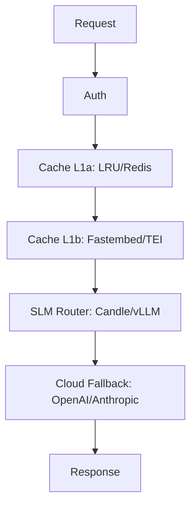

# Isartor Architecture: Layers & Modes

## Layered Funnel Overview

Isartor implements a multi-layer funnel for prompt routing and caching, using a Pluggable Trait Provider pattern. Each layer can be swapped between Minimalist (embedded) and Enterprise (external/K8s) modes via environment variables.

### Layer Definitions

| Layer           | Minimalist Single-Binary           | Enterprise K8s                |
|:---------------:|:----------------------------------:|:-----------------------------:|
| **L1a Cache**   | In-memory LRU (ahash + parking_lot)| Redis cluster (shared cache)  |
| **L1b Semantic**| Fastembed CPU (in-process)         | External TEI (optional)       |
| **L2 Router**   | Embedded Candle/Qwen2 (in-process) | Remote vLLM/TGI server        |
| **L3 Fallback** | Cloud LLM (OpenAI/Anthropic)       | Cloud LLM (OpenAI/Anthropic)  |

- **L1a Exact Match Cache:** Fast LRU cache for prompt deduplication.
- **L1b Semantic Cache:** Vector search for semantically similar prompts.
- **L2 SLM Router:** Local or remote SLM inference (Candle, vLLM, TGI).
- **L3 Cloud Fallback:** External LLMs (OpenAI, Anthropic) for last-resort answers.

## Pluggable Trait Provider Pattern

- All layers are implemented as Rust traits and adapters.
- Backends are selected at startup via `ISARTOR__` environment variables.
- No code changes or recompilation required to switch modes.

## Mermaid.js Diagram



## Mode Switching Example

```bash
# Switch cache to Redis
export ISARTOR__CACHE_BACKEND=redis
export ISARTOR__REDIS_URL=redis://redis-cluster.svc:6379

# Switch router to remote vLLM
export ISARTOR__ROUTER_BACKEND=vllm
export ISARTOR__VLLM_URL=http://vllm.svc:8000
export ISARTOR__VLLM_MODEL=meta-llama/Llama-3-8B-Instruct
```

## See Also
- [README.md](../README.md)
- [docs/ARCHITECTURE.md](ARCHITECTURE.md)
