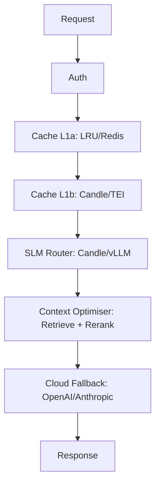

# Isartor Architecture: Layers & Modes

> **Pattern:** Hexagonal Architecture (Ports & Adapters)
> **Location:** `src/core/`, `src/adapters/`, `src/factory.rs`

## Deflection Stack Overview

Isartor implements a multi-layer Deflection Stack for prompt routing and caching, using a Pluggable Trait Provider pattern. Each layer can be swapped between Minimalist (embedded) and Enterprise (external/K8s) modes via environment variables.

### Layer Definitions

| Layer           | Minimalist Single-Binary           | Enterprise K8s                |
|:---------------:|:----------------------------------:|:-----------------------------:|
| **L1a Cache**   | In-memory LRU (ahash + parking_lot)| Redis cluster (shared cache, async, via redis crate)  |
| **L1b Semantic**| Candle BertModel (in-process)      | External TEI (optional)       |
| **L2 Router**   | Embedded Candle/Qwen2 (in-process) | Remote vLLM/TGI server        |
| **L2.5 Context Optimiser** | In-process rerank (retrieve + rerank, e.g., top-K selection) | Distributed rerank (optional, e.g., TEI/ANN pool) |
| **L3 Fallback** | Cloud LLM (OpenAI/Anthropic)       | Cloud LLM (OpenAI/Anthropic)  |

- **L1a Exact Match Cache:** Fast LRU cache for prompt deduplication (single-binary) or distributed Redis cache (enterprise/K8s). Uses async Rust `redis` crate for high-throughput shared caching.
- **L1b Semantic Cache:** Vector search for semantically similar prompts.
- **L2 SLM Router:** Local or remote SLM inference (Candle, vLLM, TGI).
- **L2.5 Context Optimiser:** Retrieves and reranks candidate documents or responses to minimize downstream token usage. Implements top-K selection, reranking, or context window optimization. Instrumented as `context_optimise` span.
- **L3 Cloud Fallback:** External LLMs (OpenAI, Anthropic) for last-resort answers.

## Semantic Cache: Pure-Rust Vector Search

Isartor's semantic cache uses in-memory brute-force cosine similarity search over embeddings. This provides:

- Sub-millisecond vector search latency (in-memory)
- Scalable cache for thousands of embeddings
- Automatic eviction and TTL handling
- Pure Rust implementation — zero C/C++ dependencies

The vector cache is maintained in tandem with the cache entries. Insertions and evictions update the index automatically.

## Pure-Rust Inference Stack

Isartor uses [candle](https://github.com/huggingface/candle) for all in-process ML inference. No ONNX Runtime, no C++ toolchain, no platform-specific shared libraries — just `cargo build`.

- **Layer 1b Embeddings:** `sentence-transformers/all-MiniLM-L6-v2` via `candle_transformers::models::bert::BertModel` (384-dimensional, ~90 MB). Model weights are auto-downloaded from Hugging Face Hub on first startup.
- **Layer 2 Classification:** Gemma-2-2B-IT GGUF via candle (in-process, no sidecar).

## Pluggable Trait Provider Pattern

All layers are implemented as Rust traits and adapters. Backends are selected at startup via `ISARTOR__` environment variables — no code changes or recompilation required.

Rather than feature-flag every call-site, we define **Ports** (trait interfaces in `src/core/ports.rs`) and swap the concrete **Adapter** at startup. This keeps the Deflection Stack logic completely agnostic to the backing implementation.

## Scalability Model

```text
Level 1 (Edge)           Level 2 (Compose)        Level 3 (K8s)
┌────────────────┐       ┌────────────────┐       ┌────────────────┐
│ Single Process  │       │ Firewall + GPU  │       │ N Firewall Pods │
│ memory cache    │──▶    │ Sidecar         │──▶    │ + Redis Cluster │
│ embedded candle │       │ memory cache    │       │ + vLLM Pool     │
│ context opt.    │       │ (optional)      │       │ (optional)      │
└────────────────┘       └────────────────┘       └────────────────┘
```

**Key insight:** Switching to `cache_backend=redis` unlocks true multi-replica scaling. Without it, each firewall pod maintains an independent cache.

## Directory Layout

```text
src/
├── core/
│   ├── mod.rs            # Re-exports
│   └── ports.rs          # Trait interfaces (ExactCache, SlmRouter)
├── adapters/
│   ├── mod.rs            # Re-exports
│   ├── cache.rs          # InMemoryCache, RedisExactCache
│   └── router.rs         # EmbeddedCandleRouter, RemoteVllmRouter
├── factory.rs            # build_exact_cache(), build_slm_router()
└── config.rs             # CacheBackend, RouterBackend enums + AppConfig
```

## Configuration

| Env Variable                 | Config Field       | Default      | Values             |
|------------------------------|--------------------|--------------|--------------------|
| `ISARTOR__CACHE_BACKEND`     | `cache_backend`    | `memory`     | `memory`, `redis`  |
| `ISARTOR__ROUTER_BACKEND`    | `router_backend`   | `embedded`   | `embedded`, `vllm` |
| `ISARTOR__REDIS_URL`         | `redis_url`        | `redis://127.0.0.1:6379` | Any Redis URI |
| `ISARTOR__VLLM_URL`          | `vllm_url`         | `http://127.0.0.1:8000`  | vLLM base URL |
| `ISARTOR__VLLM_MODEL`        | `vllm_model`       | `gemma-2-2b-it` | Model name string  |

## Mermaid Diagram



## Adding a New Adapter

1. **Define the struct** in `src/adapters/cache.rs` or `src/adapters/router.rs`.
2. **Implement the port trait** (`ExactCache` or `SlmRouter`).
3. **Add a variant** to the config enum (`CacheBackend` or `RouterBackend`) in `src/config.rs`.
4. **Wire it** in `src/factory.rs` with a new `match` arm.
5. **Write tests** — each adapter module has a `#[cfg(test)] mod tests`.

No other files need to change. The middleware and pipeline code operate only on `Arc<dyn ExactCache>` / `Arc<dyn SlmRouter>`.

## See Also

- [README.md](../README.md)
- [Configuration Reference](5-CONFIGURATION-REF.md)
